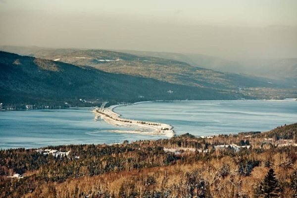
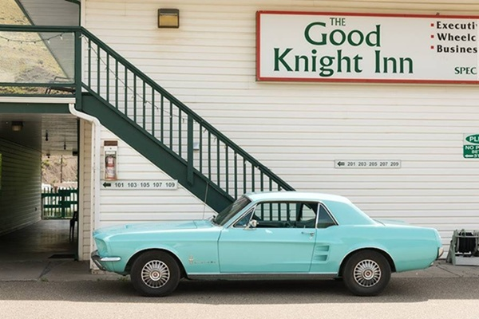
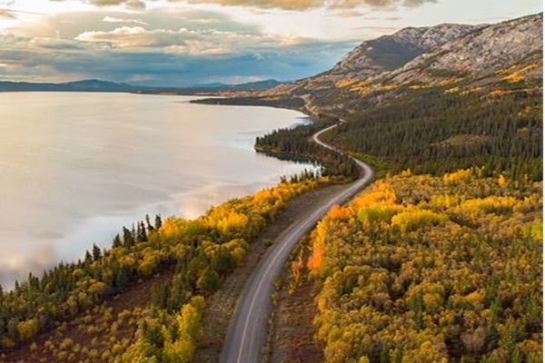
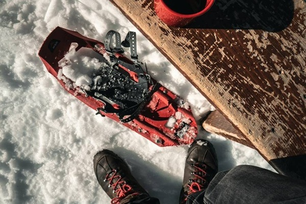
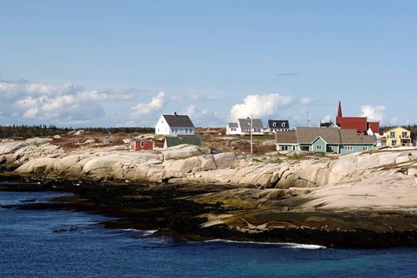
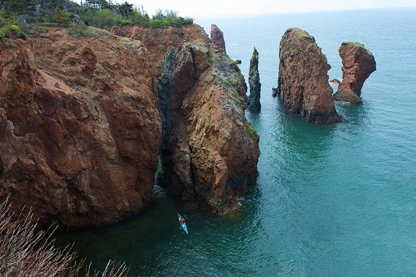
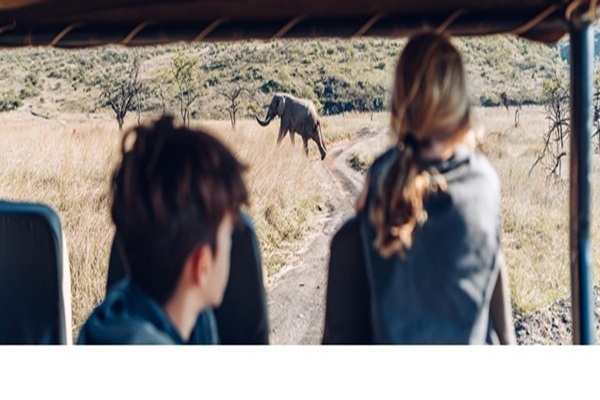

# tp3-guide-de-voyage
Ce site est un site vitrine (guide de voyage) qui permettra aux amoureux de voyage de bien choisir leur destination touristique pour un court ou long séjour.
Il comporte 5 pages:

<!-- <h2>Des idées de voyages au Canada</h2>
            

            

            
Puisez l’inspiration dans nos suggestions avant de personnaliser votre voyage

            
            <!-- SourceImage: https://fr.freepik.com/photos-vecteurs-libre/voyage-canada/4#uuid=d39b88e0-e1c1-4a85-9ed6-573fbb032d2b -->
            <h3>Sur les routes de Nouvelles-Écosse</h3>
            
Randonner et rouler dans une province élégante, nuancée, lestée d'histoire et baignée d'air.
            
20 jours, de 8000$ à 12000$

            

            

            
                <!-- SourceImage: https://fr.freepik.com/photos-vecteurs-libre/voyage-canada/4#uuid=d39b88e0-e1c1-4a85-9ed6-573fbb032d2b -->
            <h3>De Vancouver aux Rocheuses-L'Ouest canadien en train d'exception</h3>
            
Gagner les Rocheuses à bord d'un train panoramique; filer en liberté sur la route des glaciers.

            
10 jours, de 7500$ à 10000$

            

            

            
             <!-- source:https://www.voyageursdumonde.ca/voyage-sur-mesure/recherche-voyage/voyage-canada -->
            <h3>Du Pacifique aux Rockies-Family trip à travers l'Ouest canadien</h3>
            
Côte sauvage, lacs émeraude, montagnes vertigineuses et glaciers enneigés: un grand road-trip familial, de la Colombie-Britannique à l'Alberta.

            
17 jours, de 5600$ à 8500$

            

            

            
             <!-- source:https://www.voyageursdumonde.ca/voyage-sur-mesure/recherche-voyage/voyage-canada -->
            <h3>De Québec au Nouveau-Brunswick- À la rencontre de l'Acadie</h3>
            
De parcs naturels en villages côtiers, faire la rencontre d'une province aussi culturelle que maritime.

            
16 jours, de 4500$ à 5500$

            

            

            
             <!-- source:https://www.voyageursdumonde.ca/voyage-sur-mesure/recherche-voyage/voyage-canada -->
            <h3>Toronto, Niagara, lac Ontario-Road-trip sauvage et refuges au bord de l'eau</h3>
            
Sillonner l'Ontario, après Toronto et les chutes du Niagara, la nature pour seul horizon.

            
10 jours, de 4500$ à 6500$

            

            

            
             <!-- source:https://www.voyageursdumonde.ca/voyage-sur-mesure/recherche-voyage/voyage-canada -->
            <h3>Yukon et Alaska- Summertime sur la dernière frontière</h3>
            
Sillonner le Grand Nord américano-canadien, à travers des paysages purs à couper ls souffle.

            
05 jours, de 3000$ à 4500$

            

            

            
             <!-- source:https://www.voyageursdumonde.ca/voyage-sur-mesure/recherche-voyage/voyage-canada -->
            
Passionnés de vie sauvage, il existe de nombreuses façons de voyager pour aller au contact de la faune et l'observer dans son milieu naturel.
               Bien sûr, le plus mythique reste le voyage d'observation des animaux au Canada lors de grands safaris dans les parcs nationaux.
   
            
01 jour, de 30$ à 100$

            

            
 -->